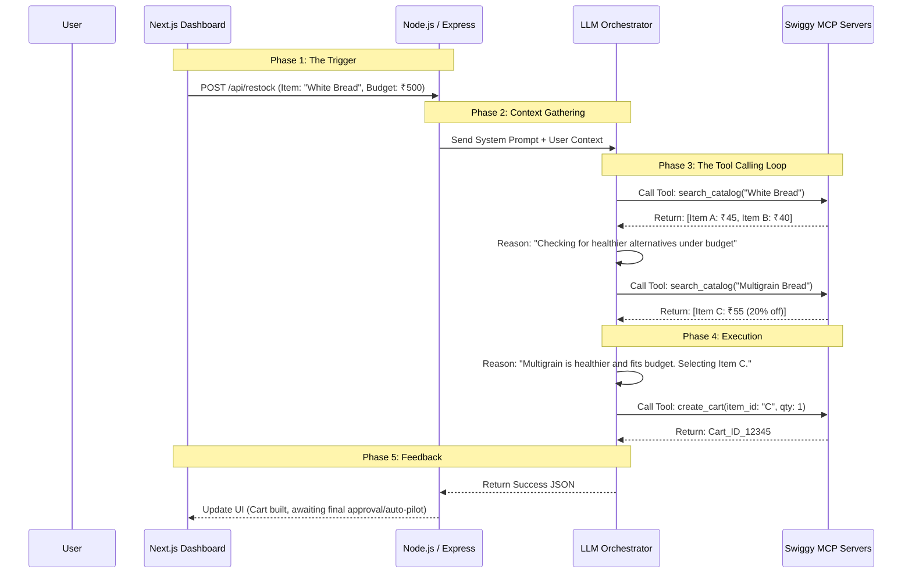

# 🧠 InstaStock AI: LLM Orchestration & MCP Architecture

This document outlines the core technical architecture of the AI reasoning engine that powers InstaStock AI. It details how we utilize Large Language Models (LLMs) alongside Swiggy's Model Context Protocol (MCP) to achieve autonomous, real-world actions.

---

## 1. The Core Philosophy: Reasoning over Hardcoding

Traditional e-commerce automation relies on brittle, hardcoded scripts (e.g., `if item.stock == 0 then execute purchase(item_id)`). This fails in the real world:
- What if the item is out of stock on Swiggy?
- What if the price surged by 50% overnight?
- What if there is a healthier alternative on sale?

**InstaStock AI** solves this by using an **LLM Orchestrator** (like Gemini 1.5 Pro or Llama 3). Instead of giving the system a rigid script, we give it a *goal*, *context*, and *tools*. The LLM uses its reasoning capabilities to navigate edge cases dynamically.

---

## 2. The Model Context Protocol (MCP)

The Model Context Protocol (MCP) is the bridge between the digital reasoning of the LLM and the physical fulfillment network of Swiggy. 

Because an LLM cannot natively browse the Swiggy app or click buttons, Swiggy exposes **MCP Servers**. These servers provide secure, standardized "Tools" (functions) that the LLM is permitted to call.

For InstaStock AI, we utilize three primary MCP domains:
1. **Catalog MCP:** Allows the LLM to search for items, check live inventory in nearby dark stores, and compare prices.
2. **Cart/Ordering MCP:** Allows the LLM to programmatically construct a shopping cart and initiate the checkout flow.
3. **Delivery MCP:** Allows the system to track the physical delivery status to notify the user.

---

## 3. Architecture Flow Diagram

---

## 4. The Step-by-Step Execution Flow

When a pantry item hits a `Critical` status and triggers a restock (either manually via 1-Click Approve or autonomously via Auto-Pilot), the following sequence occurs:

### Step 1: Context Injection
The Node.js backend receives the trigger. It compiles a "Context Payload" that includes:
- The item needed (e.g., "Full Cream Milk").
- The user's monthly budget and current spend.
- The user's preferences (e.g., "Prefers organic when price difference is < 15%").

### Step 2: Prompting the Orchestrator
The context is wrapped in a strict System Prompt and sent to the LLM. 

**Example System Prompt:**
> "You are InstaStock AI, an autonomous pantry manager. The user needs 'Full Cream Milk'. Their remaining budget is ₹750. You have access to Swiggy MCP tools. Search the catalog. If exact matches are unavailable, find the closest substitute. Optimize for health if the price increase is negligible. Do not exceed the budget. Once decided, use the cart creation tool."

### Step 3: The ReAct Loop (Reason + Act)
The LLM enters a ReAct loop. It does not just output an answer; it outputs a request to use a tool. 
- It asks to use `search_catalog`.
- The backend intercepts this, executes the real Swiggy MCP call, and feeds the JSON results *back* to the LLM.
- The LLM reads the JSON and decides its next move.

### Step 4: Finalization
Once the LLM is satisfied it has found the optimal product, it calls the `create_cart` MCP tool. Upon successful cart creation, the LLM exits the loop and returns a structured JSON summary to the backend, which updates the Next.js frontend.

---

## 5. Handling Edge Cases via Reasoning

The true power of this architecture shines in edge case management:

*   **Out of Stock:** If the specific brand of eggs the user likes is out of stock, the LLM reads the catalog results, recognizes the failure, and autonomously alters its search query to find a generic alternative, rather than just crashing the app.
*   **Surge Pricing:** If Swiggy is experiencing high demand and delivery fees spike, pushing the total order over the user's hard budget guardrail, the LLM's reasoning engine will detect the math failure. It will abort the `create_cart` tool and instead return a message to the dashboard: *"Restock paused. Surge pricing exceeds your ₹5000 budget. Will retry in 2 hours."*

---

## 6. Future Extensibility

Because the architecture relies on MCP, adding new Swiggy services requires zero changes to the core LLM logic. 
If Swiggy releases a "Dineout MCP", we simply provide that new tool to the LLM, and it instantly gains the ability to say: *"You ran out of groceries entirely and your budget is high. Should I just book a table at a nearby restaurant instead?"*
